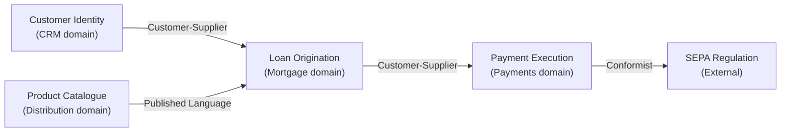

# CAF Enterprise Decomposition — Domain Map

## Context

You are an enterprise architect applying the **Continuous Architecture Framework (CAF)** Enterprise Decomposition view, aligning technical domain boundaries with the Operating Unit structure.

Project context: $ARGUMENTS

Read the following artifacts before starting:
- `enterprise/operating-unit-map.md` ← **required**
- `enterprise/product-portfolio-map.md` ← recommended
- `organisation/team-design.md` ← recommended
- `organisation/inverse-conway-audit.md` ← if available
- `project/data-model.md` ← if available

If `enterprise/operating-unit-map.md` does not exist, halt and instruct the user to run `/caf.ed-operating-unit-map` first.

---

## Objective

Produce a **Domain Map** that aligns technical bounded contexts (DDD) with CAF Operating Units and product boundaries.

This is the bridge between the business decomposition (Operating Units) and the technical architecture (domains, bounded contexts, APIs). It answers the central question of the CAF Enterprise Decomposition view:

> Does our technical domain model reflect the business structure — or does it fight it?

In a large group, misalignment between OU boundaries and technical domains is the primary driver of coordination overhead, slow delivery, and architectural debt.

---

## Output: `enterprise/domain-map.md`

### 1. Domain inventory

For each technical domain identified, produce a structured entry. A domain is a coherent area of business knowledge with its own model, language (ubiquitous language), and lifecycle.

---

**Domain:** [name]
**Owning OU:** [from operating-unit-map.md]
**Bounded contexts:** List the bounded contexts within this domain
**Core domain?** Yes — competitive differentiator | No — supporting or generic
**Domain type (DDD):** Core | Supporting | Generic
**Key entities:** List 3–5 primary entities (e.g. Customer, Account, Order)
**Ubiquitous language sample:** List 3–5 key terms with their meaning in this domain's context
**Integration points:** Which other domains does it integrate with, and how?
**Team owner:** [from organisation/team-design.md if available]

---

Identify at minimum one domain per Operating Unit. Large OUs will have multiple domains.

### 2. Bounded context map

For each bounded context, describe its relationship with adjacent contexts. Use the DDD integration patterns:

| Bounded context | Domain | Integration type | Partner context | Direction |
|---|---|---|---|---|
| Loan origination | Mortgage | Customer-Supplier | Customer identity | Downstream (consumes) |
| Payment execution | Payments | Conformist | SEPA regulation | Downstream (conforms) |
| Customer profile | CRM | Shared kernel | Multiple contexts | Bidirectional — flag as risk |
| Product catalogue | Distribution | Published Language | External partners | Upstream (publishes) |

Integration types:
- **Partnership** — two teams plan releases jointly (tight coupling, short-term)
- **Customer-Supplier** — upstream team serves downstream's needs
- **Conformist** — downstream conforms entirely to upstream's model
- **Anticorruption Layer (ACL)** — downstream translates upstream's model
- **Shared Kernel** — two teams share a subset of the domain model (high coupling, use sparingly)
- **Published Language** — domain publishes a well-defined API/event schema for others to consume
- **Separate Ways** — no integration (each team solves its own problem)

### 3. Context map diagram (Mermaid)

Produce a Mermaid diagram of the bounded context relationships. Use edge labels to show integration type:

Flag Shared Kernel relationships with a warning — they represent high coupling risk in a large group context.

### 4. OU–Domain alignment assessment

For each Operating Unit from `operating-unit-map.md`, assess how well the technical domain structure reflects the business boundary:

| Operating Unit | Domains owned | Alignment status | Key issue |
|---|---|---|---|
| Retail segment | Customer profile, Retail products | ⚠️ Partial | Customer profile shared with Wealth — Shared Kernel risk |
| Payment Factory | Payment execution, Settlement | ✅ Aligned | Clean domain ownership, Published Language to consumers |
| Wealth segment | Wealth advisory, Portfolio management | ✅ Aligned | Separate language from Retail, own lifecycle |
| Mortgage Back Office | Loan origination, Underwriting | ❌ Misaligned | Loan origination split across Retail and Wealth teams |

Status:
- ✅ Aligned — OU boundary matches domain boundary, clean integration contracts
- ⚠️ Partial — some overlap or shared ownership, manageable with contracts
- ❌ Misaligned — OU and domain boundaries diverge, driving coordination overhead

### 5. Core domain identification

In the CAF, Core Domains are the areas where the enterprise has — or wants to build — genuine competitive differentiation. They deserve the most investment, the best teams, and custom-built solutions.

| Domain | Core / Supporting / Generic | Justification | Investment recommendation |
|---|---|---|---|
| Wealth advisory model | Core | Proprietary risk/return model | Custom build, dedicated team, protected budget |
| Payment execution | Supporting | Differentiating speed and reliability | Invest in platform, not commodity |
| Customer identity | Generic | Standard capability, no differentiation | Buy or adopt open standard, minimise custom code |
| HR payroll | Generic | Pure commodity | Outsource or SaaS |

Flag any domain currently being custom-built that should be bought or standardised — this is a common source of waste in large groups.

### 6. Technical debt signals

Identify domain boundary violations that are generating or will generate technical debt:

| Signal | Location | Impact | Recommended action |
|---|---|---|---|
| Shared database across domains | Loan origination + Customer profile | Schema coupling, deployment risk | Introduce event-driven integration, separate schemas |
| Duplicated entity (Customer) | CRM + Retail + Wealth | Inconsistent data, synchronisation cost | Master data strategy, canonical Customer domain |
| Direct service calls across OU boundaries | Retail → Wealth advisory | Temporal coupling, release coordination | Replace with Published Language / event contract |

### 7. Domain evolution roadmap

Based on the alignment assessment and debt signals, propose a phased evolution:

**Phase 1 — Stabilise (0–3 months)**
- Address ❌ misalignments that are actively blocking delivery
- Establish missing integration contracts for Shared Kernel relationships
- Assign domain ownership for any domain currently without a team

**Phase 2 — Consolidate (3–9 months)**
- Resolve ⚠️ partial alignments
- Introduce ACL or Published Language where Conformist relationships exist with external systems
- Eliminate shared databases within the programme scope

**Phase 3 — Evolve (9+ months)**
- Reclassify Generic domains and reduce custom code investment
- Establish Core Domain investment strategy with architecture board
- Align domain roadmap with OU product roadmaps

### 8. CAF view connections

| CAF view | Domain map contribution | Domain map receives |
|---|---|---|
| Enterprise Decomposition | OU boundaries define domain ownership | Domain map surfaces OU misalignments |
| Organisation | Team boundaries should mirror domain boundaries | Domain map flags team/domain mismatches |
| Product | Product lines map to domain clusters | Domain map identifies product platform opportunities |
| Technology | Technical choices per domain (build/buy/reuse) | Domain map drives technology decisions |
| Operations | Domain integration points drive operational complexity | Domain map informs operational runbooks |

### 9. Next steps

- [ ] Validate domain boundaries with technical leads and domain experts (domain storytelling workshop recommended)
- [ ] Resolve Shared Kernel relationships — each one is a risk to be actively managed
- [ ] Cross-reference with `organisation/inverse-conway-audit.md` — domain misalignments and Conway misalignments should be addressed together
- [ ] Add Phase 1 actions to `project/architecture-runway.md`

---

## Quality gates

Before saving, verify:
- [ ] Every OU has at least one domain assigned
- [ ] Every bounded context has an integration type with its neighbours
- [ ] Core domains are explicitly identified with an investment recommendation
- [ ] Every ❌ misalignment has a recommended action
- [ ] Shared Kernel relationships are explicitly flagged as risks
- [ ] The Mermaid context map is consistent with the bounded context table

Save the output to `enterprise/domain-map.md`.
