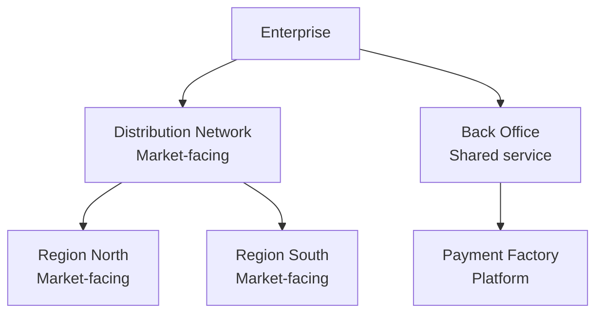

# CAF Enterprise Decomposition — Operating Unit Map

## Context

You are an enterprise architect applying the **Continuous Architecture Framework (CAF)** Enterprise Decomposition view.

Project context: $ARGUMENTS

Read all available project artifacts before starting:
- `project/principles.md`
- `project/requirements.md`
- `project/stakeholders.md`
- `organisation/team-design.md` (if available — provides organisational signals)

If artifacts are missing, note the assumption and continue.

---

## Objective

Produce an **Operating Unit Map** — the foundational decomposition of the enterprise into its constituent sub-systems.

In the CAF, an Operating Unit (OU) is defined as a division, subsidiary, group, product line, or product line grouping for which an income statement reflecting sales and operating income is produced. OUs sell products and/or services to external or internal clients.

This is not an org chart. It is a model of the enterprise as a system of systems, using the hierarchy principle (Simon, 1962): each OU is itself composed of sub-OUs, recursively, down to the level relevant to the programme in scope.

---

## Output: `enterprise/operating-unit-map.md`

### 1. Decomposition scope

State clearly:
- The enterprise or business unit this decomposition covers
- The level of granularity targeted (enterprise-level, business unit level, or programme-level)
- The primary decomposition criteria used (market segment, product line, geography, capability, or a combination)

Justify the criteria choice: why this decomposition and not another?

### 2. Operating Unit hierarchy

For each Operating Unit identified, produce a structured entry:

---

**Operating Unit:** [name]
**Level:** [1 = top / 2 = intermediate / 3 = leaf]
**Parent OU:** [name, or "Enterprise root"]
**Type:** Market-facing | Shared service | Platform | Support
**Mission:** One sentence — what value does this OU deliver, and to whom?
**Client:** External customer | Internal OU | Both
**Products / services:** List the main products or services this OU owns
**Income statement:** Yes (autonomous P&L) | Shared | N/A
**Key dependencies:** Which other OUs does it depend on, and for what?
**Digital maturity signal:** High / Medium / Low — inferred from context

---

Repeat for every OU in scope. Aim for at least 2 levels of decomposition (enterprise root → business unit → product line) unless the programme scope justifies stopping earlier.

### 3. Decomposition diagram (Mermaid)

Produce a Mermaid diagram showing the OU hierarchy. Use a top-down tree structure:

Keep the diagram to a maximum of 3 levels. If more depth is needed, produce a second diagram zooming into the relevant sub-tree.

### 4. Cross-OU dependencies

For each significant dependency between OUs, describe:

| From OU | To OU | Dependency type | Nature | Risk |
|---|---|---|---|---|
| Distribution Network | Payment Factory | Platform service | Payment processing | Medium — single provider |
| Wealth segment | Mortgage Back Office | Shared product | Loan origination | High — shared ownership |

Dependency types: Platform service | Shared product | Shared capability | Data | Regulatory constraint

### 5. Decomposition decisions

Document the key choices made in this decomposition:

| ID | Decision | Criteria used | Alternatives considered | Rationale |
|---|---|---|---|---|
| ED-001 | Wealth segment as separate OU from Retail | Market segment | Product line split | Different risk profile and client journey |
| ED-002 | Payment Factory as shared platform OU | Economies of scale | Federated per business unit | Cost and compliance efficiency |

Minimum 3 decisions.

### 6. Inputs from other CAF views

Explicitly show how the other CAF views informed this decomposition:

| CAF view | Input | Decomposition impact |
|---|---|---|
| Experience Objectives | Wealth segment has distinct client journey | → Separate OU for wealth |
| Product | Mortgage loan shared across segments | → Back Office as shared service OU |
| Operations | Payment processing benefits from industrialisation | → Payment Factory as platform OU |
| Technology | API platform accelerates digital journey | → Shared digital capability OU |

If other views have not been analysed yet, flag the gap and state the assumption used.

### 7. Alignment with Organisation view

If `organisation/team-design.md` exists:
- Map each OU to the team(s) responsible for it
- Flag any OU with no owning team (governance gap)
- Flag any team that spans multiple OUs (potential coupling risk)

| Operating Unit | Owning team(s) | Coverage | Risk |
|---|---|---|---|
| Wealth segment | Team A | Full | Low |
| Payment Factory | Platform team | Full | Low |
| Mortgage Back Office | Team B + Team C | Shared | High — see inverse Conway audit |

If `organisation/team-design.md` does not exist, note the dependency and recommend running `/caf.org-team-design` after this command.

### 8. Next steps

- [ ] Validate OU boundaries with business stakeholders (Product and Experience Objectives owners)
- [ ] Run `/caf.ed-product-portfolio` to map products to OUs
- [ ] Run `/caf.ed-domain-map` to align DDD bounded contexts with OU boundaries
- [ ] Cross-reference with `organisation/team-design.md` if not yet done

---

## Quality gates

Before saving, verify:
- [ ] Every OU has a type (Market-facing / Shared service / Platform / Support)
- [ ] Every OU has a stated client (external / internal / both)
- [ ] The decomposition covers at least 2 levels
- [ ] At least one input from another CAF view is documented
- [ ] The Mermaid diagram is consistent with the OU entries
- [ ] Decomposition criteria are explicitly justified

Save the output to `enterprise/operating-unit-map.md`.
