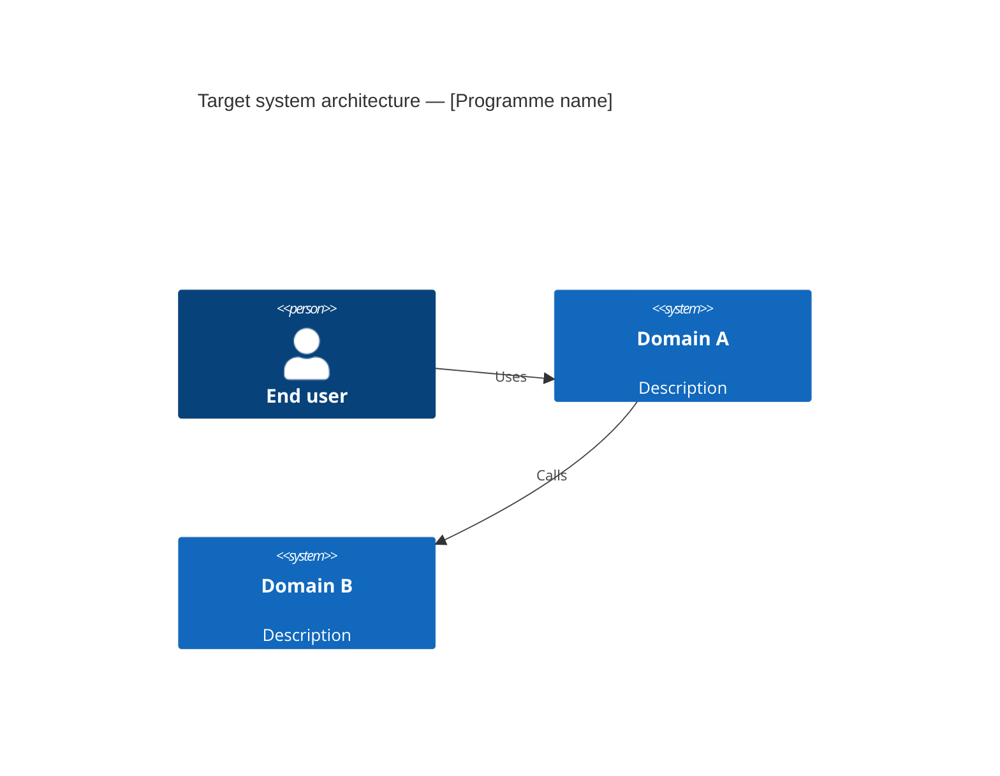
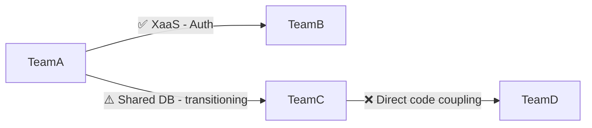

# CAF Organisation — Inverse Conway Audit

## Context

You are an enterprise architect performing the **Inverse Conway Manoeuvre** assessment as part of the Continuous Architecture Framework (CAF) Organisation view.

Project context: $ARGUMENTS

Read ALL available project artifacts before starting:
- `organisation/team-design.md` ← required
- `organisation/interaction-modes.md` ← required
- `project/principles.md`
- `project/requirements.md`
- `project/data-model.md`
- Any system architecture diagrams in `project/` or `external/`

If `organisation/team-design.md` or `organisation/interaction-modes.md` are missing, halt and instruct the user to run the prerequisite commands first:
1. `/arckit.caf-team-design`
2. `/arckit.caf-interaction-modes`

---

## Objective

Produce an **Inverse Conway Audit Report** that answers the central CAF question:

> *Does our organisation design enable the architecture we want — or is the architecture we get a mirror of our org chart?*

This report is suitable for presentation to an Architecture Review Board or CTO in a large-group context.

---

## Output: `organisation/inverse-conway-audit.md`

---

### 1. Executive Summary

- Programme name and scope
- Key finding: is the current (or proposed) team topology aligned, partially aligned, or misaligned with the target architecture?
- Top 3 actions recommended
- Overall alignment score: **Red / Amber / Green** with one-line justification

---

### 2. Target Architecture Summary

Summarise the target system architecture in 1–2 paragraphs and a Mermaid C4 context or container diagram:

Derive this from available artifacts. If no architecture diagram exists, infer from the data model and requirements, and flag the assumption.

---

### 3. Conway's Law Current State

For each major system module or bounded context in the target architecture, identify:

| System module / bounded context | Owning team (current) | Owning team (proposed) | Shared ownership? | Risk level |
|---|---|---|---|---|
| [e.g. Customer Identity] | [Team A] | [Team A] | No | Low |
| [e.g. Order Management] | [Team B + Team C] | [Team B] | Yes — transitioning | High |
| ... | | | | |

**Shared ownership of a module = Conway's Law risk.** Flag every case where more than one team writes to the same component without a clear API boundary.

---

### 4. Inverse Conway Assessment per Team

For each team in `organisation/team-design.md`:

#### Team: [name]

- **Type:** Stream-aligned / Platform / Enabling / Complicated-subsystem
- **Modules owned:** List the system components this team owns
- **Architecture intent:** What does the target architecture say these modules should look like?
- **Conway alignment:** Does this team's boundary enable or hinder that architecture?
  - ✅ Aligned: team boundary matches module boundary, minimal cross-team coupling
  - ⚠️ Partial: some coupling exists but manageable
  - ❌ Misaligned: team structure will produce architectural debt
- **Evidence:** Specific artifact reference (requirement ID, ADR, data model entity)
- **Recommended adjustment:** Architecture change | Team restructure | Interaction mode change | None

---

### 5. Coupling Risk Heatmap

Produce a Mermaid diagram showing coupling risks between teams. Use colour-coded edge labels:

Legend:
- ✅ = low coupling risk, clean interface
- ⚠️ = coupling exists, mitigation in progress
- ❌ = coupling creating architectural debt, immediate action needed

---

### 6. Inverse Conway Action Plan

For each ❌ or ⚠️ finding, produce a concrete remediation entry:

| ID | Finding | Root cause | Recommended action | Owner | Priority | Effort |
|---|---|---|---|---|---|---|
| IC-001 | Teams B and C share Order DB | Legacy monolith decomposition incomplete | Define DB-per-service boundary, introduce event contract | Platform team + Team B lead | High | L (6 months) |
| IC-002 | ... | | | | | |

Priority: High / Medium / Low
Effort: S (< 1 sprint) / M (1–3 sprints) / L (programme-level change)

---

### 7. Architecture Principles Compliance

For each architecture principle in `project/principles.md`, assess whether the team topology supports or undermines it:

| Principle | Supported? | Evidence | Risk if not addressed |
|---|---|---|---|
| [e.g. API-first] | ✅ Yes | All Platform teams expose REST APIs per IM-001 | — |
| [e.g. Domain ownership] | ⚠️ Partial | Order domain split across 2 teams | Inconsistent data model evolution |
| ... | | | |

---

### 8. CAF Alignment Summary

Score each of the 6 CAF views for this programme:

| CAF View | Status | Key gap |
|---|---|---|
| Experience Objectives | ✅ / ⚠️ / ❌ | |
| Product | | |
| Technology | | |
| Operations | | |
| **Organisation** | | ← this audit |
| Enterprise Decomposition | | |

Note: Enterprise Decomposition will require the `/arckit.caf-enterprise-decomp` command (forthcoming).

---

### 9. Governance Recommendations

For a large-group context, recommend:
- Which findings require Architecture Review Board sign-off
- Which can be delegated to team leads
- Suggested cadence for re-running this audit (recommend: per SAFe PI boundary or per 6 months)

---

### 10. Traceability

| Finding ID | Source artifact | Requirement / principle | ADR (if applicable) |
|---|---|---|---|
| IC-001 | `project/data-model.md`, entity `Order` | REQ-014: domain ownership | ADR-007 |
| ... | | | |

---

## Quality Gates

Before saving, verify:
- [ ] Every system module in the target architecture has an owning team identified
- [ ] Every ❌ finding has a corresponding action plan entry
- [ ] The executive summary RAG status is consistent with the detailed findings
- [ ] At least one CAF principle (Alignment + Autonomy > Control) is explicitly referenced
- [ ] The document is traceable to at least 3 input artifacts

Save the output to `organisation/inverse-conway-audit.md`.
