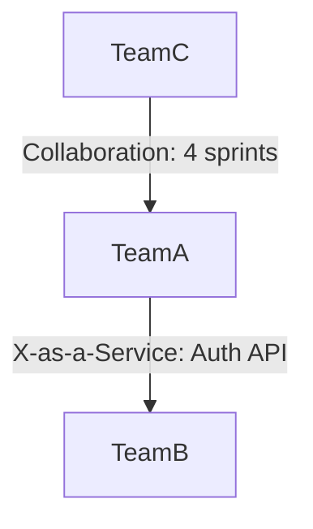

# CAF Organisation — Team Design (Team Topologies)

## Context

You are an enterprise architect applying the **Continuous Architecture Framework (CAF)** Organisation view to a large-scale IS programme.

Project context: $ARGUMENTS

Read all available ArcKit project artifacts before starting:
- `project/principles.md` (architecture principles)
- `project/requirements.md` (functional and non-functional requirements)
- `project/data-model.md` (domain boundaries if available)
- `project/stakeholders.md` (key stakeholders and their concerns)

If any artifact is missing, note the assumption you are making and continue.

---

## Objective

Produce a **Team Design Document** grounded in Team Topologies (Skelton & Pais) and the CAF Organisation view. The output must enable an architecture board in a large group to understand, challenge, and approve the proposed team structure.

---

## Output: `organisation/team-design.md`

Structure the document as follows:

### 1. Executive Summary (max 10 lines)
- Programme name, number of teams proposed, key rationale
- Primary cognitive load concern being addressed

### 2. Team Topology Model

For each team, produce a table entry with these fields:

| Field | Content |
|---|---|
| **Team name** | Descriptive, domain-aligned name |
| **Type** | Stream-aligned / Platform / Enabling / Complicated-subsystem |
| **Mission** | One sentence: what value does this team own end-to-end? |
| **Bounded domain** | Which DDD domain / bounded context does it own? |
| **Key capabilities** | 3–5 skills or responsibilities |
| **Team size** | Recommended headcount range (use Dunbar's number constraint: ≤ 8–12) |
| **Cognitive load assessment** | Intrinsic / Extrinsic / Germane load — is it within bounds? |
| **Dependencies** | Which other teams does it depend on, and for what? |

Aim for a minimum of one Platform team and at least two Stream-aligned teams. Flag if a Complicated-subsystem team is warranted.

### 3. Interaction Modes Map

For each pair of teams that interact, specify the mode:

- **Collaboration** (short-term, high-bandwidth, for discovery or innovation)
- **X-as-a-Service** (stable API contract, low coupling)
- **Facilitating** (enabling team helping stream-aligned team upskill)

Present as a matrix or a Mermaid diagram (prefer Mermaid for large group readability):

### 4. Cognitive Load Analysis

For each Stream-aligned team:
- List the domains, services, or components they are responsible for
- Assess whether the total load is within bounds (flag if > 2 bounded contexts or > 3 major services per team)
- Recommend split or platform offload if overloaded

### 5. Organisational Risks

| Risk | Likelihood (H/M/L) | Impact (H/M/L) | Mitigation |
|---|---|---|---|
| Shared ownership of domain X leading to coordination bottleneck | | | |
| Platform team understaffed vs demand | | | |
| ... | | | |

Populate with at least 4 risks specific to the project context.

### 6. Architecture Alignment Statement

Summarise how this team design:
- Reflects (or intentionally departs from) the current system architecture
- Enables the inverse Conway manoeuvre if the architecture needs to evolve
- Aligns with the CAF principle: ALIGNMENT + AUTONOMY > CONTROL

### 7. Decision Log

| ID | Decision | Rationale | Alternatives considered |
|---|---|---|---|
| TD-001 | | | |

Document at least 3 key design decisions made during this exercise.

### 8. Next Steps

- [ ] Validate team boundaries with domain owners
- [ ] Run Architecture Kata with proposed team structure
- [ ] Cross-reference with `organisation/interaction-modes.md`
- [ ] Schedule Team Autonomy Readiness assessment (CAF ritual)

---

## Quality Gates

Before saving the artifact, verify:
- [ ] Every team has a type (Stream-aligned / Platform / Enabling / Complicated-subsystem)
- [ ] No team owns more than 2 bounded contexts without a cognitive load justification
- [ ] At least one Platform team is defined
- [ ] All interaction modes are specified (no undeclared dependencies)
- [ ] The document references at least one ArcKit input artifact

Save the output to `organisation/team-design.md`.
